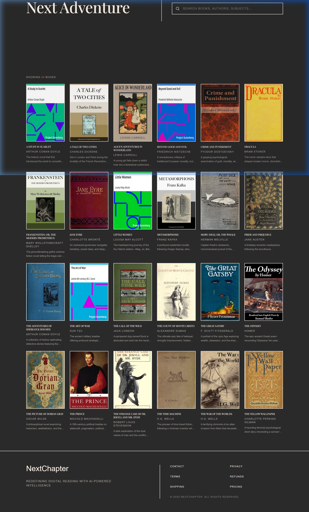
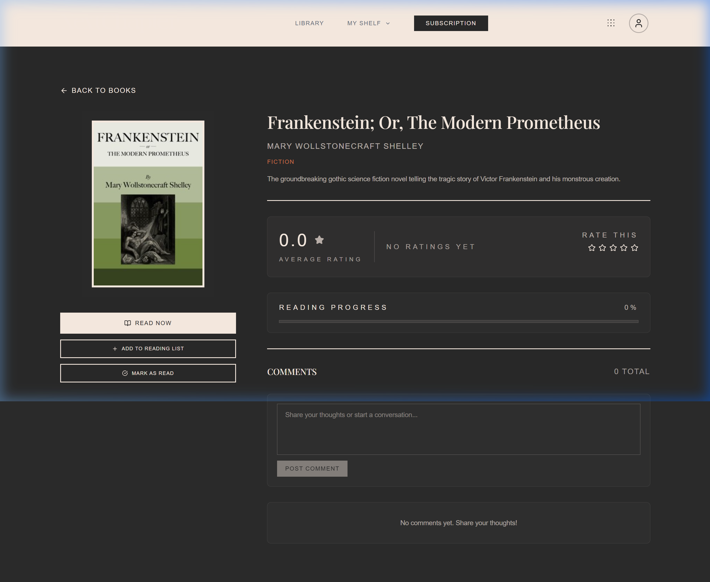
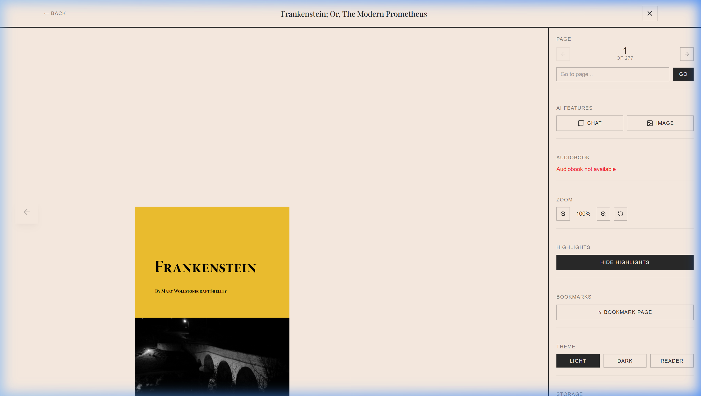

# NextChapter - Digital Library and AI Reading Platform

Live Application: [https://next-chapter-reader.vercel.app](https://next-chapter-reader.vercel.app)

---

## Live Deployment Links

- Frontend Application: [https://next-chapter-reader.vercel.app](https://next-chapter-reader.vercel.app)
- Backend AI and RAG Microservice: [https://nextchapter-backend-ai.onrender.com](https://nextchapter-backend-ai.onrender.com)
- Database and Cloud Storage: [https://supabase.com](https://supabase.com)
- GitHub Source Repository: [https://github.com/Mudit-R/NextChapterReader](https://github.com/Mudit-R/NextChapterReader)

---

## Visual Preview

### 1. Live Book Catalog & Exploration Grid


### 2. Book Detail, Ratings & Discussion


### 3. In-Browser PDF Reader with Canvas Rendering (150% Zoom)


---

## Overview

NextChapter is a full-stack digital reading and library management platform designed for seamless book exploration, high-performance in-browser PDF rendering, and AI-powered reading assistance.

Users can browse public-domain classics, customize their library shelves, track reading progress with visual metrics, and interact with an in-book grounded RAG assistant featuring anti-spoiler guardrails that prevent future chapter leaks based on the reader's current page.

---

## Key Features

### 1. In-Book Grounded RAG Assistant with Anti-Spoiler Guardrails
- Grounded Question Answering: Retrieves relevant passages directly from the current book text to answer character, plot, and thematic inquiries without external hallucination.
- Dynamic Page Cutoff: Reader specifies their current reading position (e.g. Page 42). The vector search and retrieval engine automatically ignores all chunks originating after page 42, guaranteeing zero spoilers.
- Dynamic Model Resolver: Automatically routes synthesis requests through Groq Cloud API with fallbacks across Llama 3.3 70B, Allam 2 7B, and Qwen 2.5.
- Deep Reasoning Cleaner: Strips internal thought blocks and provides structured, cited responses.

### 2. High-Performance In-Browser PDF Reader
- Canvas-Based Page Rendering: High-resolution PDF rendering powered by PDF.js with continuous vertical scroll and responsive width scaling.
- Default 150 Percent Zoom: Reader opens at an optimized 150% magnification level for reading comfort across mobile, tablet, and widescreen displays.
- Dual-Stage LRU Memory Caching: Renders lightweight thumbnails offscreen while maintaining high-resolution canvases for visible pages and immediate neighbors.
- Auto-Saving Progress: Tracks exact page number and percentage completion, persisting state to Supabase and localStorage.
- Offline Storage Support: Direct caching of document bytes in browser Cache API for instant reloads.

### 3. Bookmarking and Annotation Engine
- Multi-Color Text Highlighting: Select any passage on screen to highlight in yellow, green, pink, or blue.
- Persistent Highlighting: Highlight boundaries and color identifiers are preserved per book ID and re-applied across reading sessions.
- Interactive Bookmarks: Jump to bookmarked pages from the navigation panel or delete outdated markers with a single click.

### 4. AI Content Moderation Microservice
- Automated Screening: Asynchronous inspection of user comments, replies, and community reviews.
- Multi-Category Detection: Flags hate speech, toxicity, harassment, and severe profanity using structured Pydantic schemas.
- Non-Blocking Fallback: Automatically falls back to local heuristics if the AI microservice is cold-starting, ensuring user actions never hang.

### 5. Reading Analytics and Personal Dashboard
- Visual Activity Charts: Daily, weekly, and monthly reading volume graphs rendered with Recharts.
- Reading Goals and Streaks: Tracks daily consecutive reading streaks, total books read, and progress toward annual reading targets.
- Library Shelves: Categorizes titles into Currently Reading, Want to Read, and Completed.
- Statistics Aggregator: Computes estimated time spent reading, average reading velocity, and completion rates.

### 6. User Personalization and Customization
- Onboarding Flow: Tailored book recommendations based on user-selected genres, authors, and languages.
- Dual Theme System: High-contrast Dark and Light modes with persistent preference storage.
- Profile Management: Editable user avatars, usernames, and reading bios.

### 7. Community Discussion and Moderation
- Nested Discussion Threads: Real-time discussion boards per book with top-level comments and threaded replies.
- Upvoting and Reactions: Community ranking system for insightful discussions.
- User Reporting: Report offensive or inappropriate commentary with specific violation categories.

### 8. Admin Portal and Bulk Data Ingestion
- Batch CSV Uploads: Ingest dozens of books simultaneously using standard CSV templates with automated image and PDF association.
- Catalog Management: Direct editing of book titles, authors, descriptions, genre tags, and publication years.
- Storage Management: Direct integration with Supabase public storage buckets (`Book-storage`).

---

## Cloud Architecture

```text
[ Client Browser: React 18 + Vite SPA on Vercel ]
                    │
                    ├── Auth / REST ───> [ Supabase Cloud ]
                    │                      ├── PostgreSQL Database
                    │                      ├── Auth Service (Email & Google OAuth)
                    │                      └── Storage Bucket (Book-storage)
                    │
                    └── AI Requests ───> [ Render Web Service ]
                                           ├── FastAPI Python Backend
                                           ├── Grounded RAG Engine
                                           └── Groq Cloud API (Llama 3 / Allam / Qwen)
```

---

## Database Schema Breakdown

The platform runs on PostgreSQL via Supabase with complete Row-Level Security (RLS) policies:

| Table Name | Purpose | Access Control (RLS) |
| :--- | :--- | :--- |
| `public.books` | Book metadata, cover URLs, and Supabase Storage PDF links | Public read, admin write |
| `public.user_profiles` | User biographical info, favorite genres, authors, and themes | Public read, owner update |
| `public.user_books` | User library status (reading, read, want_to_read) and progress | Owner read and write |
| `public.book_ratings` | 1-to-5 star book reviews and ratings | Public read, user write |
| `public.book_reads` | Read event log for trending analytics and activity graphs | Public read, user write |
| `public.book_comments` | Top-level book discussion comments and upvote counters | Public read, authenticated write |
| `public.book_comment_replies` | Threaded replies to book comments | Public read, authenticated write |
| `public.book_comment_reactions`| Upvotes on comments | Public read, authenticated write |
| `public.book_reply_reactions`  | Upvotes on comment replies | Public read, authenticated write |
| `public.book_comment_reports`  | Moderation reports filed against comments | Authenticated user write |
| `public.book_reply_reports`    | Moderation reports filed against replies | Authenticated user write |
| `public.user_subscriptions`    | Membership tiers and subscription status | Owner read |
| `public.public_stats`          | Platform-wide counters (readers, pages read) | Public read |

---

## Tech Stack Summary

- Frontend: React 18, Vite, Tailwind CSS, Framer Motion, Lucide React, Recharts, PDF.js, React Router DOM, Socket.io Client
- Backend AI: FastAPI, Python 3.11, Pydantic, Uvicorn, Requests, Httpx
- Cloud Database: Supabase PostgreSQL, Supabase Storage, Supabase Auth
- AI Inference: Groq Cloud API

---

## Local Development and Deployment

### 1. Repository Setup
```bash
git clone https://github.com/Mudit-R/NextChapterReader.git
cd NextChapterReader
```

### 2. Frontend Configuration
```bash
cd frontend
npm install
npm run dev
```

### 3. Backend AI Configuration
```bash
cd backendAI
python -m venv venv
# On Windows:
.\venv\Scripts\activate
# On macOS/Linux:
source venv/bin/activate

pip install -r requirements.txt
python -m uvicorn main:app --host 0.0.0.0 --port 8001 --reload
```

---

## License

This project is licensed under the MIT License.
